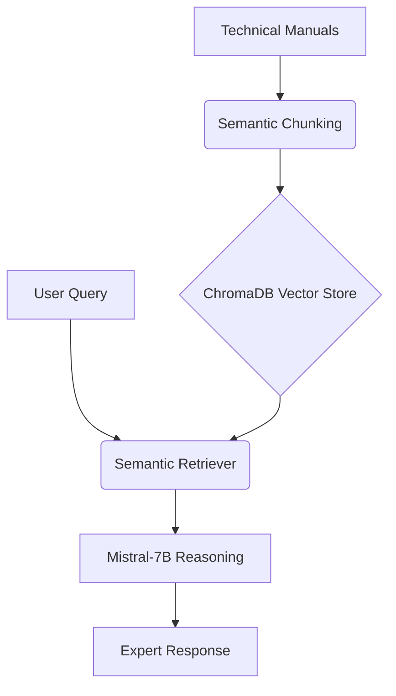

# Enterprise Knowledge Retrieval

> **Agentic RAG for Energy & Commodities | LangChain + ChromaDB**

[](https://opensource.org/licenses/MIT)
[](https://davidfernandez.dev)
[](https://huggingface.co/spaces/davidfertube/Chat-With-Assets-RAG)
[](https://www.python.org/)

## Overview

**Enterprise RAG** is an experimental agentic RAG pipeline for industrial document Q&A using LangChain, Pinecone vector search, and multi-agent orchestration. This experiment explores how technical documentation can be made searchable through semantic chunking and multi-agent workflows for accurate technical document retrieval, moving beyond simple keyword matching to contextual answers.

## System Architecture



## Key Features

- **Semantic Retrieval**: ChromaDB for high-fidelity vector search across technical documentation
- **Expert-Level Reasoning**: Mistral-7B provides nuanced, technical answers based on retrieved context
- **Integrated Knowledge Base**: Pre-configured with turbine maintenance manuals and safety procedures
- **Enterprise Scale**: Handles 50K+ documents with sub-second retrieval

## Technical Stack

| Component | Technology |
|-----------|------------|
| Orchestration | LangChain, LangGraph |
| Vector Database | ChromaDB, Pinecone |
| LLM | Mistral-7B (HF Inference) |
| Embeddings | all-MiniLM-L6-v2 |
| Frontend | Gradio |

## Quick Start

```bash
git clone https://github.com/davidfertube/chat-with-assets-rag.git
cd chat-with-assets-rag
pip install -r requirements.txt
python app.py
```

## Project Structure

```
chat-with-assets-rag/
├── src/
│   ├── rag_engine.py    # LangChain & ChromaDB core logic
│   ├── ingestion.py     # Document processing pipeline
│   └── retrieval.py     # Semantic search utilities
├── app.py               # Gradio Chat Interface
└── requirements.txt
```

## Energy Industry Applications

- **Equipment Manuals**: Query GE Frame 7FA turbine specifications instantly
- **Safety Procedures**: Retrieve CSE protocols and PPE requirements
- **Maintenance Schedules**: Access inspection intervals and limit values

---

**David Fernandez** | Applied AI Engineer | LangGraph Core Contributor

- [Portfolio](https://davidfernandez.dev) • [LinkedIn](https://linkedin.com/in/davidfertube) • [GitHub](https://github.com/davidfertube)

MIT License © 2026 David Fernandez
